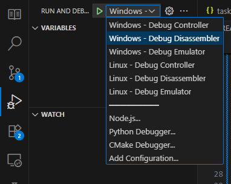

# 8080 Emulator
TODO: Add project description.

## Required tools

### Common tools
- [VSCode](https://code.visualstudio.com)
  - [C/C++ Extension](https://code.visualstudio.com/docs/languages/cpp)
- [CMake](https://cmake.org): Used for build configuration. Download and install latest version, or through your distro's package manager, i.e. `sudo apt-get install cmake`.
- GNU tools, (**gcc**, **g++**, **gdb**, **make**). Most linux distros already have them included. For Ubuntu: `sudo apt-get install build-essential`.
- QT Dev tools. For Ubuntu: Simply `sudo apt install qt6-base-dev qt6-tools-dev`. This won't install any of the GUI design programs. For that, consider [Qt Creator](https://www.qt.io/product/development-tools).

### For Windows
- [Setting up VSCode development environment in Windows](https://code.visualstudio.com/docs/languages/cpp). **IMPORTANT:** Follow the instructions on [how to install MinGW-x64 on Windows](https://code.visualstudio.com/docs/languages/cpp#_example-install-mingwx64-on-windows), including updating the PATH variable to get access to the utilities, and installing the development toolchain.
  - [MSYS2](https://www.msys2.org): Used to get GNU tools. Install latest version. Alternatively, install [Cygwin](https://www.cygwin.com) or [MinGW](https://www.mingw-w64.org) directly.
- [Qt Creator](https://www.qt.io/product/development-tools): The most straightforward way to run Qt in Windows is directly installing Qt Creator, although it can be a bit cumbersome due to the huge downlode size, and the fact that you need to create an account.

## Building project
The CMake configuration creates multiple subprojects, one for each main component of the system:
- Model (Emulator)
- View (UI)
- Controller (APIs)

In VSCode, press `CTRL + SHIFT + B`, then select the desired build recipe, or alternatively run the build scripts on the command line:

### On windows:
- Run `build.bat` to build the project.
- Run `clean.bat` to clean all the binaries.

### On Linux/MacOs (bash)
- Run `./build.sh` to build the project.
- Run `./clean.sh` to clean all the binaries.

## Debugging
### On VSCode
- Select the debug configuration depending on the platform used:

### On GDB
Alternatively you can run the built executables in the `out` folder with GDB to debug directly from the command line.