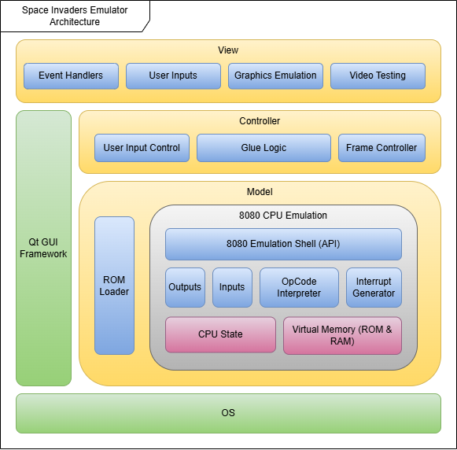
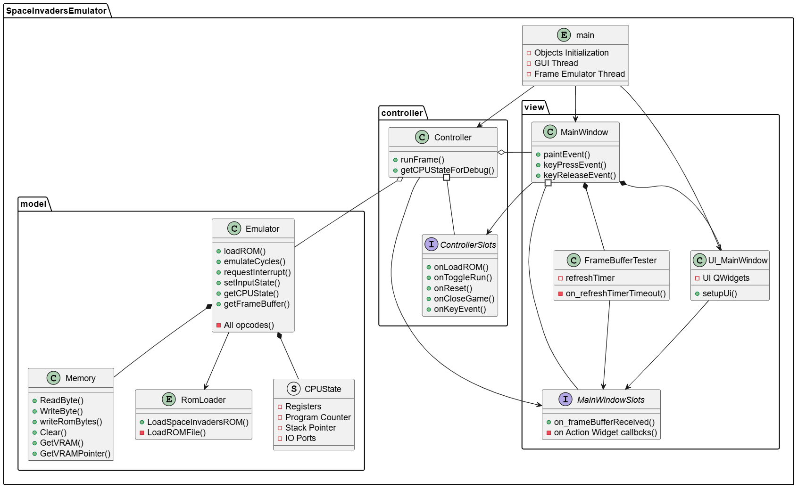

# Project Architecture Overview

## Overview

This document outlines the high-level architecture, key components, and data flow for the Intel 8080 emulator designed to run Space Invaders. The project follows a **Model–View–Controller (MVC)** architecture, built in C++ with Qt for GUI rendering.

## Block Architecture
The following is a simplified block architecture diagram, showing the separation and concerns and which components are close to each other. (Does not necessarily reflect the code structure, but the guide towards the desing.)


---

## Architecture Pattern: MVC

| Layer     | Modules |
|-----------|---------|
| **Model** | `Emulator`, `Memory`, `CPU`, `ROMLoader` |
| **View**  | `MainWindow`, Qt Image + Painting |
| **Controller** | `Controller` class |

- The **Model** handles emulation logic and state.
- The **View** manages all graphical user interface elements.
- The **Controller** serves as the bridge, processing input and sending commands to the Model.

## Class Diagram
This is a more detailed type of diagram to show all the dependencies, interface usage, and compositions between all the classes in the system.


---

## Core Components

### Emulator
- Central class combining CPU, Memory, and ROM loading
- Handles cycle timing and interrupt triggering

### CPU
- Executes Intel 8080 instructions
- Updates registers, flags, and program counter
- Interrupt support and conditional branching

### Memory
- Emulates 64KB segmented memory space
- Supports VRAM, read-only ROM, stack operations
- Includes debug features (snapshots, watchpoints)

### ROM Loader
- Loads 4-part ROM (`invaders.e`, `.f`, `.g`, `.h`) into memory
- Validates ROM structure and placement

### Controller
- Intermediary for signal-slot communication between Qt View and Emulator
- Handles game start/pause/reset/load and key input translation

### MainWindow (View)
- Renders video output using Qt image buffers
- Handles all user interaction (key input, menu commands)
- Paints frame buffer and color mask

---

## System Data Flow

### ROM Load Flow
```
MainWindow ➜ Controller ➜ Emulator ➜ ROMLoader ➜ Memory
```

### Game Execution Loop
```
QTimer ➜ Controller ➜ Emulator ➜ CPU & Memory ➜ VRAM ➜ Frame Buffer ➜ MainWindow
```

### Input Handling
```
Keyboard ➜ MainWindow ➜ Controller ➜ Emulator.setInputState()
```

---

## Rendering Pipeline

- Frame buffer is filled by the Emulator based on CPU execution
- Controller copies raw VRAM to a display-safe buffer
- MainWindow processes this buffer:
  - Rotates image
  - Inverts pixels
  - Applies color mask
  - Renders via `QPainter::drawImage`

---

## Testing Strategy

- `test_utils`: Test scaffolding, CPU state checks, debug tools
- Unit tests for each opcode category:
  - `cpu_arithmetic_unit_tests.cpp`
  - `cpu_logic_unit_tests.cpp`
  - `cpu_stack_unit_tests.cpp`
  - ...
- `FrameBufferTester`: Emits simulated video frames at 60Hz

---

## Tools & Environment

| Tool        | Purpose |
|-------------|---------|
| **C++**     | Core implementation |
| **Qt 6**    | GUI rendering and event loop |
| **CMake**   | Build system |
| **GitHub**  | Version control |
| **Trello**  | Project planning |
| **iMovie / OBS** | Demo recordings |

---

## Future Enhancements

- Controller/gamepad support
- Sound emulation
- Enhanced debugging GUI (breakpoints, step-through)
- Multiple game ROM compatibility
- Save/Load game state snapshots

---
