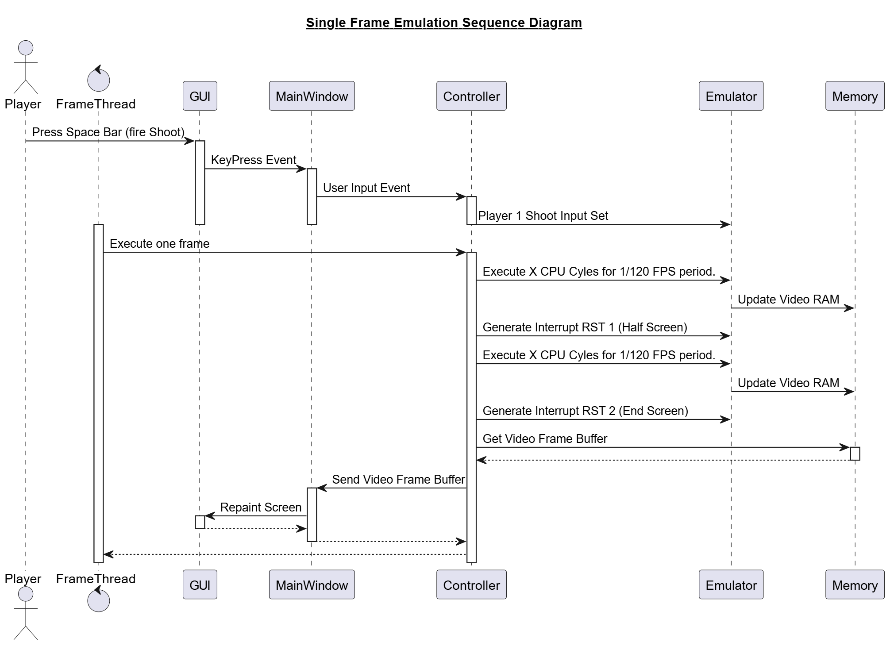

# Integration Overview

## Purpose

This document outlines how individual emulator components (CPU, Memory, Controller, ROMLoader, View) are integrated and tested together to simulate the full behavior of the Space Invaders arcade machine.

---

## Integration Structure

### 1. Emulator Integration

- The `Emulator` class acts as the integration hub:
  - Connects `CPU` to `Memory` and I/O
  - Handles interrupts, timing, and frame progression

### 2. Controller ↔ Emulator

- The `Controller` bridges Qt signals to model behavior:
  - Calls `emulator->emulateCycles()`
  - Handles `requestInterrupt()`
  - Transfers VRAM to frame buffer

### 3. Controller ↔ View (MainWindow)

- Qt `signal/slot` connections:
  - Key input events
  - ROM load requests
  - Frame buffer updates
  - Pause/reset/start interactions

### 4. Frame Buffer Flow

```
VRAM ➜ Emulator ➜ FrameBuffer ➜ Controller ➜ MainWindow ➜ QPainter
```

---

## Integrated Testing

- Emulator tested through full instruction sweeps
- View rendered frame verification
- Controller tested via simulated user inputs
- ROM loading tested with valid and invalid directories

---

## Integration Challenges

- Timing sync between frame execution and Qt update loop
- Ensuring interrupt triggers mid-frame (as in original hardware)
- Accurate transformation of frame buffer into correctly rotated image

---

## Sample Sequence
The following diagram denotes the typical flow of a user pressing an input, and the emulator running a full frame execution, while updating the video frame.
