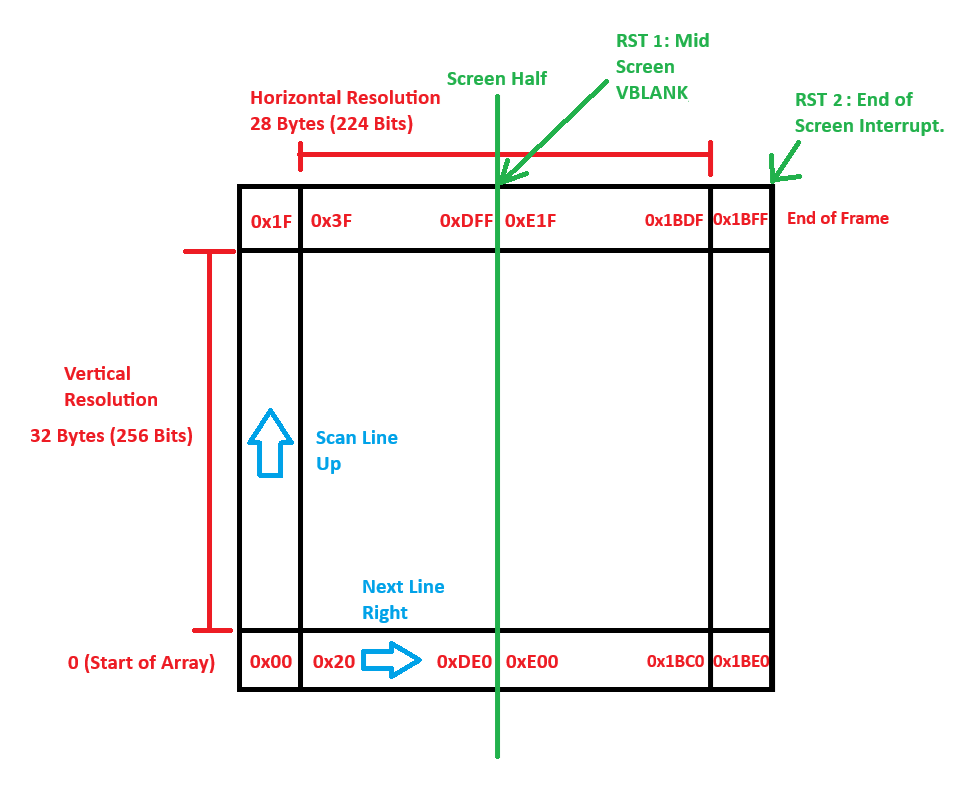

# Video Interaction & Testing Controls

## Overview

This module includes the visual simulation logic and runtime controls related to video testing, pause/resume, coin insert, and frame timing.

---

## Responsibilities

- Controls video test mode (fake visual output for testing)
- Sends control signals like coin insert and player start
- Tracks FPS and debug display performance
- Manages title updates and run-state feedback

---

## Core Methods

### `on_actionRun_Video_Test_triggered()`

- Enables or disables test mode that simulates frame updates at 60Hz
- Instantiates a `FrameBufferTester` object to emit mock frame buffers
- Blocks other UI menus while active
- Handles signal connection and object cleanup on toggle

### `pulseKey(int key, unsigned int ms, QAction* action)`

- Emits a simulated keypress (`sendKeySignal(key, true)`)
- Uses `QTimer` to auto-release the key after the delay
- Temporarily disables related menu action
- Re-enables it after releasing the key

### `toggleRun()`

- Emits `sendToggleRunSignal()` and updates the window title
- Indicates game running or paused state visually

### `resetGame()`

- Emits a reset signal and resets title bar

### `calculateFPS()`

- Calculates frame rate based on nanosecond intervals between updates
- Useful for debug prints (optional feature)

---

## Design Considerations

- Video test mode is decoupled from core emulator logic
- Key pulse simulation avoids long key holds
- Actions are menu and keyboard accessible
- GUI state is dynamically updated (e.g., title bar, menus)

---

## Screen rendering
The way the original arcade machine rendered each frame was using a classic CRT scanline, but as it turns out the CRT screen is tilted 90 degrees to the right, so the frame processing must take that into consideration.

There are two points at which the frame buffer must be saved, at the half and at the end of the screen, and each is coordinated in the emulator through interrupts RST1, and RST2.

